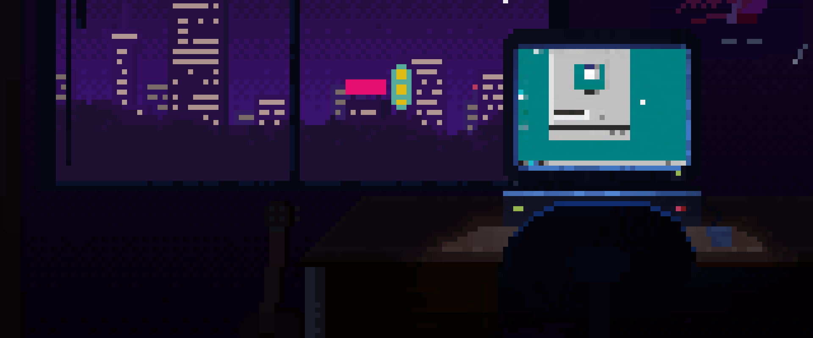

<h1 align="center">Hi, I'm Guilherme </h2>
</h1> 
<h3 align="center">A passionate Full Stack developer from Brazil</h3>
 

- 🔭 I’m currently working on [Conversão Total](https://github.com/Zythee3/ConversaoTotal)
- 🌱 I’m currently delving into React.js, Node.js

##    Languages and Tools: 
 
 
 

##    GitHub Stats:  

    

    

## Connect with me:

  

